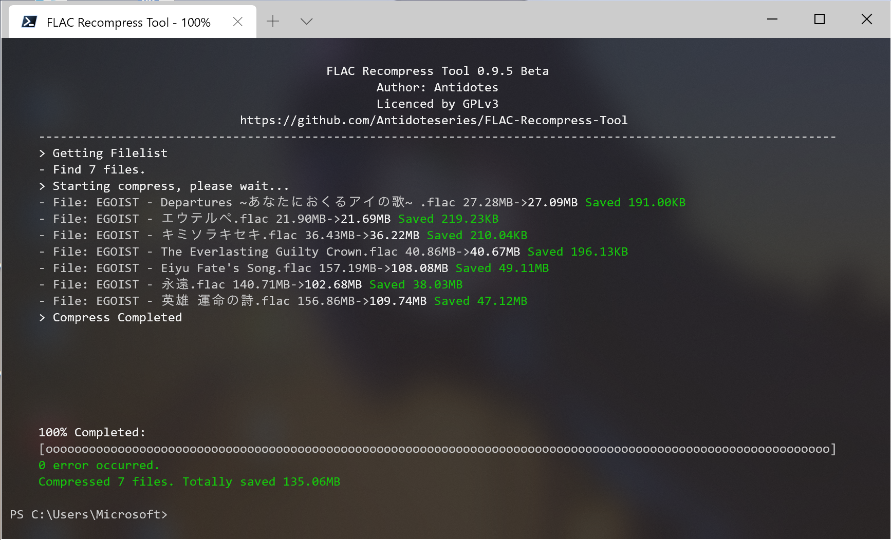

# FLAC Recompress Tool
## Please notice that the script still in developing. All features may changed before the first stable version released.

## What's this?
The script can recompress your FLAC audio file to save your disk space with the same quality. After recompression, the size of the file will reduced by up to 50%. (based on your FLAC compression level)  

It's useful for some Hi-Res Store Music like Mora.
## Quick use

`flacre [options] -path [<inputpath>] -output [<outputpath>/Replace]`

For example: `flacre.ps1 -p C:\Users\Admin\Music -o D:\Recompressed`  
See notes below for more details.

## Supports Platform
- Windows 7,8,8.1,10 or higher
- macOS 10.12 or higher
- Linux list on https://github.com/PowerShell/PowerShell/releases/

Windows support x86, x64 and ARM64
## Requirements
- PowerShell 5.1 (based on .NET Framework)
- PowerShell 7 or higher (based on .NET Core) See more at https://aka.ms/powershell

## Restricted script execution
By default, Microsoft disabled PowerShell script execution on Windows. You can use the command below to enable the script execution.  
`Set-ExecutionPolicy -ExecutionPolicy Unrestricted`

And you can use  
`Set-ExecutionPolicy -ExecutionPolicy Restricted`  
to disable it again.

## Detailed help
`-p, -path <path>`  
Input option. The argument must be existd. Support file and folder. When you input a folder, we will search all FLAC files in the folder and sub-folders.

If your input path has square brackets, please use `` `[`` or`` `]`` instead it. Because square brackets were PowerShell wildcard pattern.

`-o, -output <path> / Replace`  
Output option. Support file and folder. When output path is empty or it was same as the input path, we will create a new folder "Recompressed" in the path root and saving files. If you want to replace the older file, please use `-output Replace` .

`-t, -thread <int>`  
Thread option. It decides the number of compress threads at the same time.

`-s, -suffix <string>`  
Suffix option. It effects recompressed files' name.

`-l, -log <path>`  
Log option. You can export log to the path. By default, log will be generate in TEMP folder.

`-id3convert` (Experiment Feature)  
Enable convert id3 tag to standard FLAC tag. If not enable, FLAC with id3 tag will occurate an error.  
ID3 tag is not supported by Xiph.org officially, converting may lost metadata like title, artist and so on.

`-h, -help`  
Display help.

FLAC binary source code from https://xiph.org/flac. 